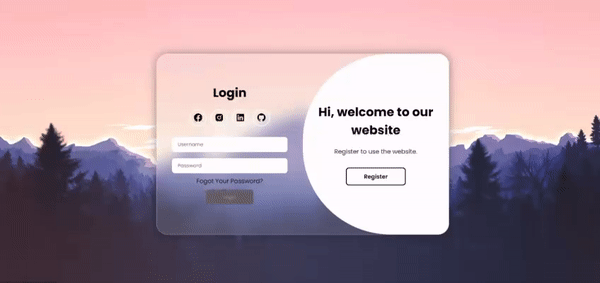

# Projeto Tela de Login e Registro Animada

## Descrição ##
Este projeto consiste em uma tela moderna de login e registro animada, desenvolvida com HTML, CSS e JavaScript. A interface é projetada para fornecer uma experiência de usuário atraente e amigável, com transições suaves e elementos interativos.

Acesse o site: https://arthurgomes1k.github.io/modern-animated-login-register/

## Instruções de Uso ##
1. Clone este repositório em sua máquina local. git clone https://github.com/arthurgomes1k/modern-animated-login-register.git

2. Abra o arquivo index.html em seu navegador.

3. Explore as funcionalidades de login e registro.

## Demonstração ##

## Contribuição ##
Sinta-se à vontade para usar, personalizar e adaptar o projeto conforme suas necessidades.
Se você encontrar bugs ou tiver sugestões para melhorias, abra uma issue ou envie um pull request.

Made with ❤️ by **Arthur Gomes**
